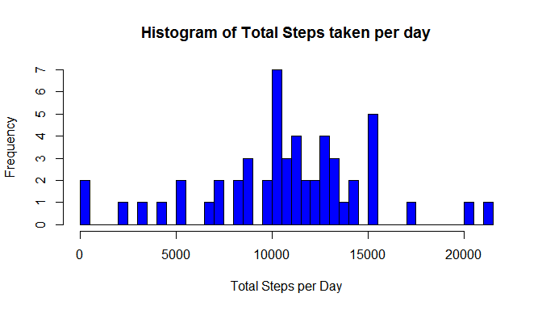
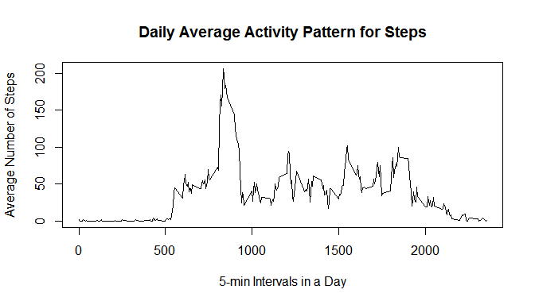

# Reproducible Research: Peer Assessment 1


## Loading and preprocessing the data

The data is loaded from the *"activity.csv"* file by using read.csv() into a data frame *aData*. There are 3 variables and 17568 observations. The variables are steps, date and interval. The total number of steps taken per day is calculated by preprocessing the data and stored in the variable *dailySteps*. The variable steps is summed for each date in the dataset.

```r
aData<-read.csv("activity.csv")
dailySteps<-by(aData$steps, aData$date, sum)
intervalSteps<-by(aData$steps, aData$interval, function(x) sum(data=x, na.rm=T))
totalDays<-nlevels(aData$date)
```

## What is mean total number of steps taken per day?

The histogram of the total number of steps taken per day is shown below.

```r
hist(dailySteps, breaks=50, main="Histogram of Total Steps taken per day", xlab="Total Steps per Day")
```



```r
mean_ds<-mean(dailySteps, na.rm=T)
median_ds<-median(dailySteps, na.rm=T)
```
The mean total number of steps taken per day is 1.0766189\times 10^{4} and the median value calculated is 10765.

## What is the average daily activity pattern?
Here is the plot of the average number of steps taken for each 5 minute interval in a day, averaged across all days. Intervals with NA values were ignored in calculating the total steps during each interval.

```r
plot(x=names(intervalSteps), y=intervalSteps/totalDays, type='l', main="Daily Average Activity Pattern for Steps", xlab="5-min Intervals in a Day", ylab="Average Number of Steps")
```




## Imputing missing values


## Are there differences in activity patterns between weekdays and weekends?
